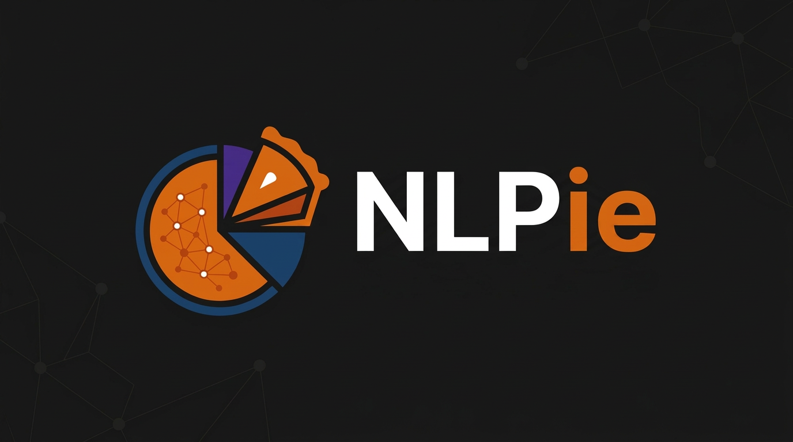

# NLPie 🥧

<p align="center">
  
</p>

> A fast, Rust-based library for evaluating, visualizing, and interpreting NLP data representations.


## 📖 Overview

While the initial scope of this project is evaluating and visualizing common NLP data representations, the real magic lies in **interpretation**. 

This tool is designed to make it easier to inspect these representations, extract actionable insights, and act as a lightning-fast preprocessor to get your data ready for downstream tasks.

## 🎯 Why does this exist?

I'm not trying to reinvent the wheel. I built this primarily as a personal daily-driver tool, mostly because I'm pretty sure young Manuel would have deeply appreciated having something like this back in the day.

I'm leaving this repository public to open the doors for community feedback, new ideas, and overall improvements. 

## 🎤 The Hannah Montana Philosophy

Another personal goal here is to learn a new language. I chose Rust because I wanted to get the best of both worlds (as Hannah Montana wisely said): 
- The **ease of use** of Python 🐍
- The **raw performance** of Rust 🦀

## ⚠️ Disclaimer

As I mentioned, I am actively learning how to program in Rust while building this. Please don't judge me if looking at the source code makes your eyes start bleeding :'( 

Constructive feedback, pull requests, and band-aids for your eyes are always welcome!

## 🧰 Project structure

This project uses a mixed Rust + Python layout with the Python package under `python/nlpie`, the Rust core under `src/`, and a `maturin`/`uv` workflow for local development. The Rust library is exposed as `nlpie._nlpie_core`, while the Python package lives in the `python` source tree configured in `pyproject.toml`.

```text
nlpie/
├── Cargo.toml
├── pyproject.toml
├── uv.lock
├── python/
│   └── nlpie/
├── src/
│   ├── bindings/
│   └── core/
└── tests/
```

## 🚀 Installation

### Prerequisites

Before running the project, make sure you have Python 3.12 or newer, a working Rust toolchain, and `uv` installed. The current project configuration requires Python `>=3.12`, uses `maturin` as the build backend, and enables the `extension-module` feature for the Rust/Python binding.

### Clone the repository

```bash
git clone https://github.com/jucrramirez/nlpie.git
cd nlpie
```

### Install Rust

If you do not have Rust installed yet:

```bash
curl https://sh.rustup.rs -sSf | sh
rustc --version
cargo --version
```

### Create or refresh the environment with uv

From the project root, create and sync the virtual environment:

```bash
uv sync
```

By default `uv sync` only installs the core dependencies. Optional extras are available:

```bash
uv sync --extra plotting          # Install plotly for interactive charts
uv sync --extra dev               # Install jupyter for running notebooks
uv sync --all-extras              # Install all extras at once
```

> **Note:** `uv sync` synchronises the environment with the lock file. Packages installed manually via `uv pip install` will be removed. Always use `uv sync --extra <name>` to include optional dependencies.

If you want to run the project inside the managed environment:

```bash
uv run python --version
```

### Build the extension

For local development, `maturin develop` builds the Rust extension and installs it into the active environment. You can also build a wheel for distribution with `maturin build`.

```bash
uv run maturin develop
uv run maturin build
```

## ▶️ Running the project

Because this project currently includes a `main.py` entry point and a Python package under `python/nlpie`, a typical local workflow is to use `uv` to sync dependencies and then run the script or tests from the project root.

### Run the main script

```bash
uv run python main.py
```

### Run the test suite

```bash
uv run pytest
```

### Run Rust tests

```bash
cargo test
```

### Run Jupyter notebooks

Make sure you have the dev extra installed:

```bash
uv sync --extra dev --extra plotting
```

Then launch Jupyter from the project root:

```bash
uv run jupyter notebook python/examples/
```

Available notebooks:

| Notebook | Description |
|---|---|
| `pipeline.ipynb` | End-to-end pipeline with synthetic embeddings |
| `pipeline_with_real_embeddings.ipynb` | Full pipeline using real 1536‑d embeddings from a parquet file |
| `normalization.ipynb` | Embedding preprocessing (L2 norm, centering, PCA whitening) |

## 🔎 Important considerations

- Run commands from the project root so `Cargo.toml`, `pyproject.toml`, and `uv.lock` are all picked up correctly.
- Keep using Python 3.12 or newer, since the project explicitly requires it.
- If the native module does not rebuild after changing Rust code, rerun `uv run maturin develop`.
- The package name is `nlpie`, but the compiled Rust extension is configured as `nlpie._nlpie_core`, so imports should match that layout.
- The project is still a WIP, so APIs and structure may change as the implementation evolves.

## 📦 Example usage

Once installed, you should be able to import the package from Python like this:

```python
import nlpie
from nlpie import (
    EmbeddingPreprocessor,
    compute_hubness,
    effective_rank,
    explain_hubness,
    plot_hubness_histogram,
    plot_quality_report,
)
```

If you want to validate the Rust extension is available:

```bash
uv run python -c "import nlpie._nlpie_core"
```

### Quick pipeline

```python
import sys, numpy as np
from nlpie.metrics.quality import evaluate_embedding_quality

embeddings = np.random.randn(200, 64).astype(np.float32)
labels = [i % 5 for i in range(200)]

report, interpretation = evaluate_embedding_quality(
    embeddings=embeddings,
    labels=labels,
    hubness_k=5,
    model_name="example",
)
print(report)
print(interpretation)

# Render an interactive dashboard (requires plotly)
fig_kpi, chart_list, fig_story = plot_quality_report(report)
fig_kpi.show()
for _, fig in chart_list:
    fig.show()
if fig_story:
    fig_story.show()
```
